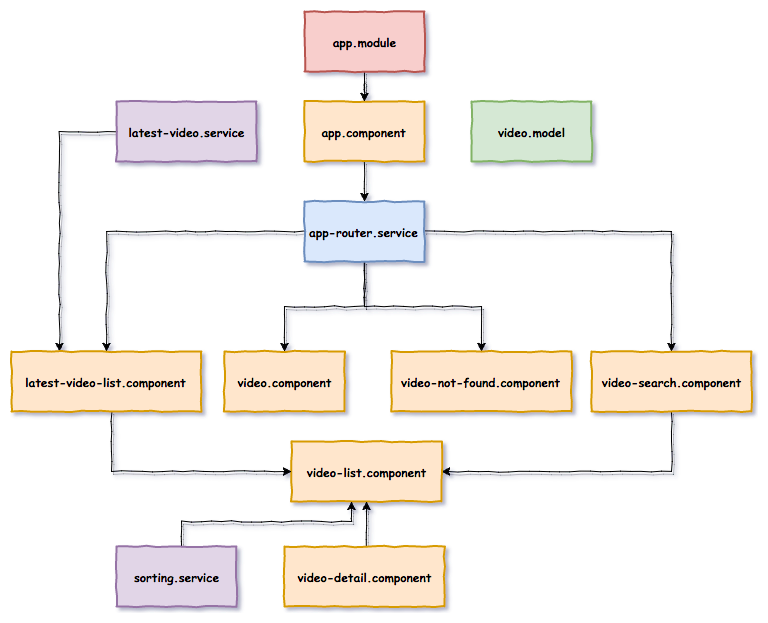
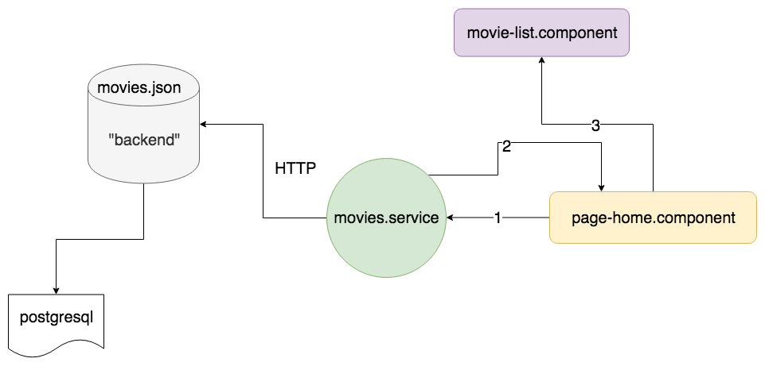

# workshop-angular-youtube

[](https://travis-ci.org/piecioshka/workshop-angular-youtube)
[](https://circleci.com/gh/piecioshka/workshop-angular-youtube)

💾 Workshop project — Test Angular app

## Demo 🎉

* Production: <https://workshop-angular-youtube.herokuapp.com/>

    ```bash
    npm run deploy:heroku
    ```

* Staging: <https://piecioshka.github.io/workshop-angular-youtube/>

    ```bash
    npm run deploy:github
    ```

* Development: <http://localhost:4200/>

    ```bash
    npm start
    ```

## Features

* :white_check_mark: Stworzenie komponentu z breadcrumbem (menu horyzontalne)
* :white_check_mark: Stworzenie komponentu z listą miniaturek (carousel)
* :no_entry: Zasilanie komponentu danymi od komponentu-rodzica — `@Input`
* :no_entry: Pobieranie informacji z komponentu-dziecka — `@Output`
* :white_check_mark: Zaprezentować listę miniaturek filmów wraz z tytułami i skróconym opisem
    + [x] TJ: Spr. czy gdy tablica jest pusta, to lista filmów jest pusta
    + [x] TJ: Spr. czy gdy tablica jest pusta, to lista filmów wyświetla fallback tekst
    + [x] TJ: Spr. czy gdy tablica jest równa 3 to liczba wyrenderowanych filmów równa jest 3
    + [ ] TE: Spr. czy po kliknięciu w film, użytkownik zostanie przeniesiony na profil filmu
* :white_check_mark: Pobierać listę filmów z serwera (`HttpClientModule`)
    + [ ] TJ: Spr. czy jest realizowany request po wyrenderowaniu komponentu
* :white_check_mark: Zaprezentować profil filmu: tytuł, poster oraz opis
    + [ ] TJ: Spr. czy są renderowane dane, które przekazujemy do komponentu
* :white_check_mark: Dodać zabezpieczenie przed wyświetleniem filmu, którego nie ma w bazie
    + [ ] TE: Spr. czy kiedy podamy nieznany ID filmu, to czy zostaniemy przekierowani na stronę 404
* :white_check_mark: Wyszukać film po tytule
    + [ ] TE: Spr. czy kiedy podamy nieznaną nazwę filmu, to czy wyświetli się komunikat z brakiem znalezionych filmów
    + [ ] TE: Spr. czy po wpisaniu nazwy istniejącego filmu, to czy zostanie on wyświetlony na liście z filmami
* :white_check_mark: Ustawić autofocus na polu wyszukiwania
    + [ ] TE: Spr. czy po wejściu do aplikacji jest od razu ustawiony focus
* :white_check_mark: Udostępnić możliwość sortowania listy filmów
    + [ ] TE: Spr. czy istnieją przyciski do sortowania
    + [ ] TJ: Spr. czy po kliknięciu w przyciski kolejność wyświetlanych elementów się zmienia
* :white_check_mark: Mechanizm paginacji (`ngx-pagination`)
    + [ ] TE: Spr. czy po wejściu na drugą stronę zmienia się lista filmów
* :white_check_mark: Zdefiniować 3 konfiguracje z innymi URLami do backendu:
    + development
    + production
    + staging
* :white_check_mark: Narysować diagram z architekturą
* :white_check_mark: Zmienić strategię URLi na `HashLocationStrategy`
* :white_check_mark: Routing Lazy Loading (strona z autorami)
* :white_check_mark: Server-side rendering



## Krok po kroku 👣

### Instalacja `Angular CLI`

<details>

* `npm install -g @angular/cli`

</details>

### Stworzenie projektu

<details>

* Create directory:

    ```bash
    mkdir workshop-angular-youtube
    ```

* Enter to new directory

    ```bash
    cd workshop-angular-youtube
    ```

* Generate an app

    ```bash
    ng new workshop-angular-youtube --directory . --minimal --routing --style css
    ```

</details>

### Dodanie CSS Framework - [Bootstrap](https://getbootstrap.com/)

<details>

* Install `bootstrap` from npm by command

    ```bash
    npm i bootstrap
    ```

* Add new record in `angular.json` -> `projects/movies/architect/build/options/styles`

    ```text
    "node_modules/bootstrap/dist/css/bootstrap.css"
    ```

    WARNING: Restart server (`ng serve`) after change configuration file

* Use widgets:
    + `card` in `MovieListItemComponent`
    + `media object` in `MovieProfileComponent`

</details>

### Strona z listą filmów

<details>

* Create files:
    + `src/app/app.components.html`
    + `src/app/app.components.css`
* In `src/app/app.components.ts` change in decorator metadata:
    + `template` -> `templateUrl`
    + `styles` -> `stylesUrl`
* Put paths into above props.
* Generate components:

    ```bash
    ng generate component page-home --spec false
    ng generate component page-movie-profile --spec false
    ng generate component movie-list --spec false
    ng generate component movie-list-item --spec false
    ng generate component movie-profile --spec false
    ```

* Create `src/app/components/` and put all components there
* Create `src/app/components/app/` and put all files with prefix `app.component`
* Build routing in `src/app/app-routing.module.ts`
    + '' = PageHomeComponent
    + 'movies/:id' = PageMovieProfileComponent

* Add link into main header which should redirect to home page
* Create file `src/assets/movies.json`
* Generate interfaces:

    ```bash
    ng generate interface movie
    ng generate interface movies
    ```

* Create directory to group interfaces in one place
* Rename interfaces:
    + `movie.ts` -> `movie.interface.ts`
    + `movies.ts` -> `movies.interface.ts`
* Create a component structure as below:

    

* Generate services:

    ```bash
    ng generate service movies --spec false
    ```

* Create (in service) methods:
    + `getMovies`
    + `getMovieById`

* Inject service `HttpClient` to make HTTP request to `/assets/movies.json` file

    

</details>

### Pobieranie dane z serwera (`HttpClientModule`)

<details>

* TODO

</details>

### Strona z profilem filmu (routing)

<details>

* TODO

</details>

### Wyszukiwarka (panel oraz strona)

<details>

* TODO

</details>

### Sortowanie listy filmów

<details>

* TODO

</details>

### Paginacja (`ngx-pagination`)

<details>

* Dodać paczkę [ngx-pagination](https://github.com/michaelbromley/ngx-pagination)
* Zaimportować do komponentu z logiką moduł `NgxPaginationModule`
* Osadzić komponent `pagination-controls` w komponencie listy
    + dodać binding input `(pageChange)="page = $event"`
    + przefiltrować kolekcję prezentowanych elementów
        `| paginate: { itemsPerPage: 10, currentPage: page }`

</details>

### Deployment — GitHub

<details>

* Add new task in `package.json` -> `scripts`

    ```text
    "predeploy": "ng build --base-href=/warsawjs-workshop-29-movies/"
    "deploy": "NODE_DEBUG=gh-pages gh-pages -d dist/movies/"
    ```

</details>

### Deployment — Heroku

<details>

* TODO

</details>

### [Bonus] Zabezpieczenie przed nieznanym identyfikatorem filmu

<details>

* TODO

</details>

### [Bonus] Lazy loading

<details>

* Stworzyć nowy moduł: `ng g module static --routing`
* Stworzyć nowy komponent: `ng g component static/author-list --module static`
* `app.component.html`: Dodać link do `/authors` w stopce
* `app-routing.module.ts`: Stworzyć nowy route:

    ```js
    {
        path: 'authors',
        loadChildren: './static/static.module#StaticModule'
    }
    ```

* `static/static-routing.module.ts`: Stworzyć nowy route:

    ```js
    {
        path: '',
        component: PageAuthorListComponent
    }
    ```

</details>

### [Bonus] Server-side rendering ([Angular Universal](https://angular.io/guide/universal))

<details>

* `app-routing.module.ts`:
    + Wyłączyć strategię URLi (zakomentować `useHash`)
* Zainstalować zależności:

    ```bash
    npm install --save @angular/http \
        @angular/platform-server \
        @nguniversal/module-map-ngfactory-loader \
        ts-loader
    ```

    oraz

    ```bash
    npm install -D webpack-cli
    ```

* `app.module.ts`:
    + Użyć funkcji `BrowserModule.withServerTransition({ appId: 'workshop-angular-youtube' }),`
* Wygenerować nowy moduł:

    ```bash
    ng g module app-server
    ```

* `app-server.module.ts`:
    + Dodać do tablicy `imports`:
        - `AppModule`
        - `ServerModule` z `@angular/platform-server`
        - `ModuleMapLoaderModule` z `@nguniversal/module-map-ngfactory-loader`
    + Dodać do tablicy `bootstrap`:
        - `AppComponent`
* Obok pliku `main.ts` stworzyć plik `main.server.ts`:
* `main.server.ts`:
    + Wyeksportować `AppServerModule`
* Skopiować `tsconfig.app.json` do `tsconfig.server.json`
* W pliku `tsconfig.server.json`:
    + `compilerOptions`
        - Dodać `"module": "commonjs"`
    + Stworzyć sekcję `angularCompilerOptions` i w niej dodać
        `"entryModule": "app/core/app-server.module#AppServerModule"`
* `angular.json`: Dodać w sekcji `architect`

    ```json
    "server": {
        "builder": "@angular-devkit/build-angular:server",
        "options": {
            "outputPath": "dist/server",
            "main": "src/main.server.ts",
            "tsConfig": "src/tsconfig.server.json"
        }
    }
    ```

* `server.ts`
    + Stworzyć plik w katalogu głównym repozytorium o treści takiej jak
        w ostatnim listing w punkcie 4.
        <https://angular.io/guide/universal#step-4-set-up-a-server-to-run-universal-bundles>
* `webpack.server.config.js`
    + Stworzyć plik w katalogu głównym o treści jak w punkcie 5.
        <https://angular.io/guide/universal#step-5-pack-and-run-the-app-on-the-server>
    + Dodać nową opcję: `mode: "none",`
* `package.json`
    + Dodać zadania zdefiniowane w: <https://angular.io/guide/universal#creating-scripts>
    + W zadaniu `build:client-and-server-bundles`
        - Zmienić `my-project` na `workshop-angular-youtube`
        - W tym samym zadaniu, usunąć `:production` z końca polecenia
* `angular.json`: Zamienić:
    + w `projects/workshop-angular-youtube/architect/build/options/`
        - klucz `outputPath` na `dist/browser`
    + w `projects/workshop-angular-youtube/architect/server/options/`
        - klucz `outputPath` na `dist/server`
* `server.ts`: Zmienić
    + `server/main` na `dist/server/main` w okolicach 25 linijki
* Uruchomić `npm run build:ssr && npm run serve:ssr`

</details>
