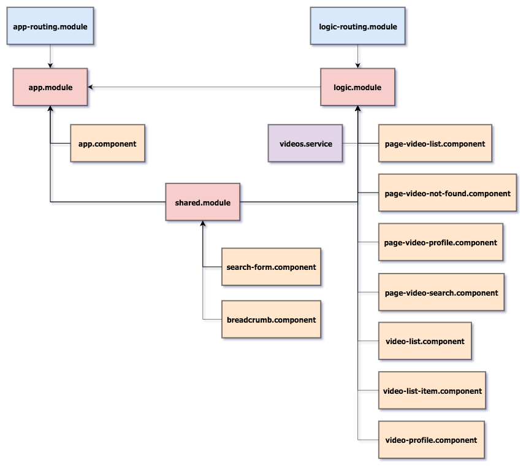

# youtube

:ledger: Aplikacja symulująca portal z filmami a'la YouTube.

## Demo 🎉

<https://piecioshka.github.io/youtube/>

## Features

* [x] Zaprezentować listę miniaturek filmów wraz z tytułami i skróconym opisem
* [x] Zaprezentować profil filmu: tytuł, poster oraz opis
* [x] Dodać zabezpieczenie przed wyświetleniem filmu, którego nie ma w bazie
* [x] Wyszukać film po tytule
* [x] Ustawić autofocus na polu wyszukiwania
* [x] Udostępnić możliwość sortowania listy filmów
* [ ] Poprawić testy jednostkowe
* [ ] Dopisać testy end-to-end
* [ ] Mechanizm paginacji
* [ ] Server-side rendering
* [ ] Routing Lazy Loading

## Krok po kroku 👣

### 1. Setup z Angular CLI

* `npm install -g @angular/cli`
* `ng new NAZWA_PROJEKTU` # youtube
* Ustawić tytuł strony: `YouTube`
* Ustawić opis strony: `Portal z filmami`
* `npm start`

### 2. Strona z listą filmów

* `ng generate component video-list`
* app.component.html -> (HTML) `<app-video-list></app-video-list>`
* `ng generate service videos`
* Przenieść `videos.service` do katalogu `src/app/logic`
* `VideosService` -> `fetchVideos`
    + Wygenerować dane testowe
* Wyświetlić listę filmów
* Stworzyć plik z mockiem do filmów
* Dodać style

### 3. Strona z profilem filmu

* `ng generate component video-profile`
* Przenieść markup filmu do `video-profile.component.html`
* W `video-list.component.html` dodać `<app-video-item>`
* Wstrzyknąć dane
    + `<app-video-list-item [video]="video"></app-video-list-item>`
    + W `video-list-item.component.ts` zdefiniować `@Input()`
* Przenieść definicję wyglądu `<video>` do `video.component.css`
* Stworzyć `video.model` i użyć w:
    + `video.component.ts`
    + `video-list.component.ts`
    + `videos.service.ts`
* `ng generate module app-routing`
* W `app.module.ts` dodać `AppRoutingModule`
* W `app-routing.module.ts` zmienić `CommonModule` na `RouterModule`
* W `app-routing.module.ts` stworzyć `routes: Routes` (path, component)
    + `` - VideoListComponent
    + `video/:id` - VideoProfileComponent
* W `app.component` dodać `<router-outlet>`
* W `video-list.component.html` przerobić na listę miniaturek z linkami
    + `<a routerLink="videos/{{ video.id }}">`
* Zaktualizować style
* W `video.component.ts`:
    + usunąć dekorator `@Input()` z pola `video`
    + pobierać parametr `id` z `ActivatedRoute` (rxjs)
    + pobierać obiekt video `VideosService`

### 4. Zabezpieczenie przed nieznanym identyfikatorem filmu

* W `video.component.html` dodać zabezpieczenie przed brakiem obiektu `video`
* `ng generate component video-not-found`
* W `app-routing.module.ts` dodać nową ścieżkę: `video-not-found`
    (PageVideoNotFoundComponent).
* W `video.component.ts` dodać sprawdzenie, czy VideosService zwrócił
    "falsy value", wtedy przekierować na stronę z komponentem
    `PageVideoNotFoundComponent` za pomocą `Router`a

### 5. Wyszukiwarka (panel oraz strona)

* `ng generate component video-search`
* W `app-routing.module.ts` dodać nową ścieżkę: `search`
    (PageVideoSearchComponent)
* W `app.component.html` stworzyć menu z linkiem do wyszukiwarki
* W `videos.service.ts` stworzyć funkcję, która będzie filtrowała filmy
    (wykorzystać już istniejącą funkcją `getVideos`)
* Dodać style dla wyszukiwarki wykorzystując dwa już istniejące:
    + `video.component.css`
    + `video-list.component.css`
* W `video-search.component.html` stworzyć pole (input), gdzie użytkownik
    będzie wpisywał tytuł filmu.
* W `video-search.component.ts` stworzyć funkcję `search`, która będzie
    uruchamiana po naciśnięciu "ENTER" przez użytkownika.

### 6. Sortowanie listy filmów

* `ng generate service sorting`
* Przenieść `sorting.service` do katalogu `src/app/video-list`
* Dodać linki, do sortowanie ASC i DESC w plikach
    + `video-search.component.html`
    + `video-list.component.html`
* Dodać funkcje sortujące: `sortAscending`, `sortDescending` w plikach:
    + `video-search.component.ts`
    + `video-list.component.ts`
* W `sorting.service.ts` stworzyć funkcje: `ascending`, `descending`
* W funkcjach `sortAscending`, `sortDescending` wykorzystać ww funkcje.

### 7. Refactoring detalu filmu

* `ng generate component video-detail`
* Wycięcie detali filmu na rzecz `<app-video-detail>` z plików:
    + `video-search.component.html`
    + `video-list.component.html`

### 8. Refactoring listy filmów

* `ng generate component videos-list`
* Zastąpienie obecnego użycia komponentu `video-list.component` nowo
    stworzonym.
* Wykorzystanie komponentu `video-list.component` w plikach
    + `video-search.component.html`
    + `videos-list.component.html`

### 9. Paginacja

* Wykorzystać paczkę `ng2-pagination` (http://michaelbromley.github.io/ng2-pagination/)
* W `app.module.ts` zaimportować nowy moduł
* Wykorzystać pipe `pagination` oraz komponent `<pagination-controls>`
    w plikach:
    + `video-list.component.html`
    + `video-search.component.html`

### (Opcjonalnie) 10. Serwer zwracający fake-owe dane

* Stworzyć dwa polecenia:
    + `npm run build:mock` — polecenie powinno generować plik na podst. JSON Schema
    + `npm run start:mock` — polecenie powinno uruchomić `json-server`

## Mockowanie danych

* http://json-schema-faker.js.org/ - narzędzie, które buduje losowe dane w JSON
* http://json-schema.org - specyfikacja budowania
* https://chancejs.com/ - biblioteka zwraca losowe dane w odpowiednim formacie
* https://github.com/marak/Faker.js/ - budowanie wielu losowych danych
